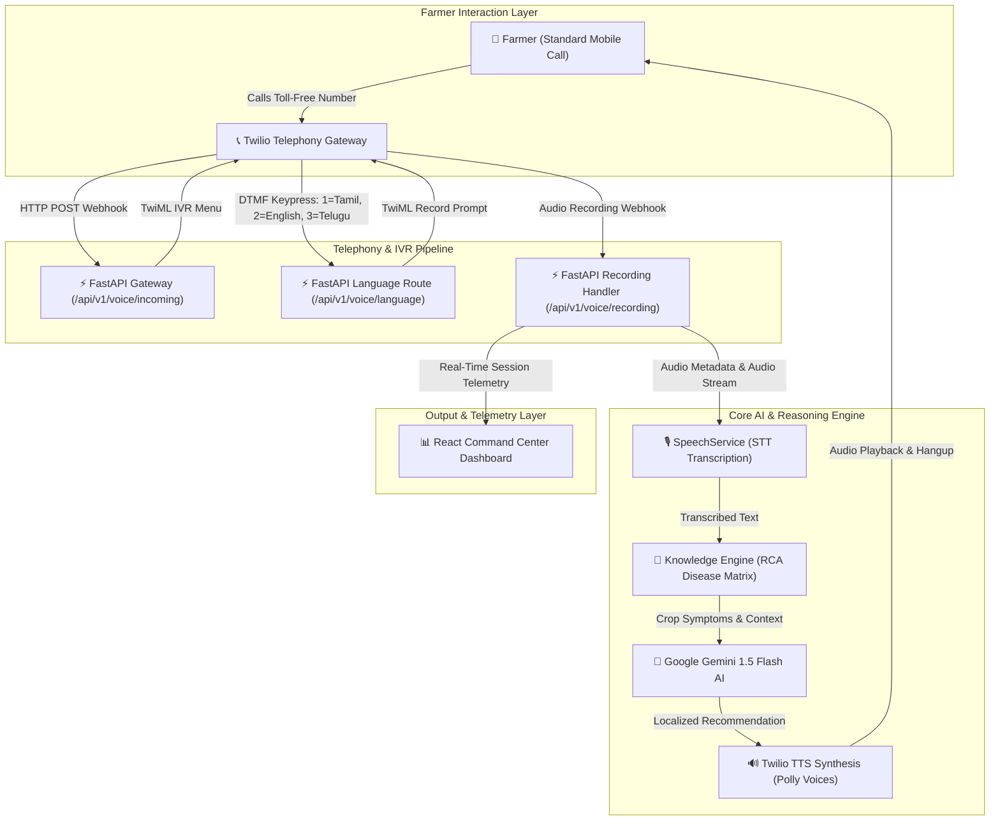
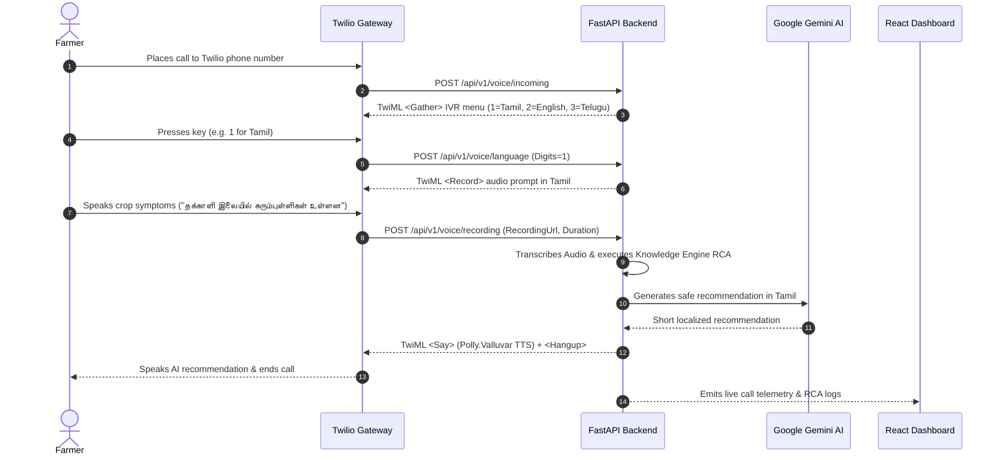

# 🌾 Krishi Mitra AI — Voice-First AI Agriculture Assistant

[](https://fastapi.tiangolo.com/)
[](https://reactjs.org/)
[](https://vitejs.dev/)
[](https://www.typescriptlang.org/)
[](https://www.twilio.com/)
[](https://ai.google.dev/)
[](https://tailwindcss.com/)

> **An AI-powered multi-lingual voice telephony system designed for smallholder Indian farmers.**  
> *Acts as an Agricultural Expert that reasons before answering — bridging the digital literacy gap via basic phone calls.*

---

## The Problem & Impact

Over **140 million farmers** in India face crop yield losses of up to **35%** annually due to delayed disease diagnosis and limited access to agricultural experts. Existing AI solutions rely on smartphones and text apps, leaving out smallholder farmers who primarily rely on voice calls and regional language dialects.

### The Solution: Krishi Mitra AI
- **No Smartphone Required**: Farmers place a standard phone call to a Twilio toll-free number.
- **Multi-Lingual IVR**: Touch-tone language selection for **Tamil (தமிழ்)**, **English**, and **Telugu (తెలుగు)**.
- **Speech-to-Text & RCA Engine**: Converts spoken dialect audio into text and executes a deterministic **Root Cause Analysis (RCA)** rule matrix across MVP crops (**Tomato**, **Paddy**, **Chilli**).
- **Gemini AI Advisory**: Generates concise, multi-lingual agricultural recommendations synthesized via Amazon Polly Text-to-Speech (TTS).

---

## System Architecture



---

## End-to-End Voice Consultation Workflow



---

## Key Features

1. **Deterministic RCA Engine**:
   - Evaluates disease confidence scores for **Tomato** (*Early Blight, Late Blight, Leaf Curl*), **Paddy** (*Blast, Brown Spot, Stem Borer*), and **Chilli** (*Anthracnose, Mildew, Aphids*).
   - Automatically escalates calls to human **Krishi Vigyan Kendra (KVK)** officers when diagnosis confidence falls below **70%**.

2. **Real-Time Telemetry Command Center**:
   - Modern dark/light glassmorphism dashboard built with React 18, Vite, and Tailwind CSS.
   - Includes Statistics Cards, Live Consultation Logs, Weather Microclimate Alerts, APMC Mandi Market Prices, and AI System Telemetry.

3. **Production Telephony & Error Recovery**:
   - Full TwiML IVR state machine supporting `<Gather>`, `<Record>`, `<Say>`, and `<Hangup>`.
   - Automatic fallback responses and localized error apologies if network or Gemini API timeouts occur.

---

## Technology Stack

| Layer | Technologies Used |
| :--- | :--- |
| **Backend API** | FastAPI, Python 3.11+, Uvicorn, Pydantic Settings, Pytest |
| **AI & LLM** | Google Gemini 1.5 Flash API (`gemini-1.5-flash`), Deterministic RCA Engine |
| **Telephony & TTS** | Twilio Voice API, TwiML, Amazon Polly (`Polly.Valluvar`, `Polly.Aditi`) |
| **Frontend Framework** | React 18, Vite, TypeScript, React Router v6 |
| **Styling & UI** | Tailwind CSS, Framer Motion, Lucide React, Glassmorphism utilities |
| **DevOps & Deploy** | Docker, Procfile (Render/Railway), Vercel SPA (`vercel.json`) |

---

## Repository Structure

```text
.
├── backend/                        # FastAPI Backend Application
│   ├── app/
│   │   ├── main.py                 # FastAPI app entry point & middleware
│   │   ├── config.py               # Centralized Pydantic environment configuration
│   │   ├── models/                 # Pydantic data models & CallSession schemas
│   │   ├── routes/
│   │   │   ├── voice.py            # Twilio voice webhooks (/incoming, /language, /recording)
│   │   │   ├── dashboard.py        # Telemetry API endpoints (/summary, /history, /weather, etc.)
│   │   │   └── health.py           # Health check endpoint (/health)
│   │   ├── services/
│   │   │   ├── agri_ai_service.py  # Google Gemini 1.5 Flash AI reasoning service
│   │   │   ├── twilio_service.py   # TwiML response generator
│   │   │   ├── speech_service.py   # Speech-to-Text transcription abstraction
│   │   │   └── call_session_service.py # In-memory session state manager
│   │   └── utils/
│   │       └── constants.py        # CallStage & system constants
│   ├── tests/                      # Pytest unit test suite (9/9 passing)
│   ├── Dockerfile                  # Containerized backend deployment
│   ├── Procfile                    # Render / Railway deployment
│   └── requirements.txt            # Python dependencies
│
├── frontend/                       # React + Vite + TypeScript Frontend
│   ├── src/
│   │   ├── components/
│   │   │   ├── dashboard/          # Modular dashboard telemetry cards
│   │   │   ├── consultation/       # Voice Studio simulator & timeline components
│   │   │   ├── layout/             # Sidebar, Navbar, and Layout containers
│   │   │   └── ui/                 # Card, Badge, and Toast components
│   │   ├── pages/                  # Dashboard, VoiceConsultation, History, KnowledgeBase, etc.
│   │   ├── services/               # Axios API client & endpoints
│   │   ├── hooks/                  # useDashboard, useVoice, useHealth custom hooks
│   │   └── theme/                  # ThemeContext (Dark/Light mode persistence)
│   ├── vercel.json                 # Vercel SPA routing configuration
│   └── vite.config.ts              # Vite bundler configuration
└── README.md                       # Comprehensive documentation
```

---

## Quick Start & Local Setup

### Prerequisites
- Python 3.11+
- Node.js 18+
- Git

### 1. Backend Setup
```bash
# Navigate to backend
cd backend

# Create & activate virtual environment
python -m venv .venv
# On Windows:
.venv\Scripts\activate
# On macOS/Linux:
source .venv/bin/activate

# Install dependencies
pip install -r requirements.txt

# Run pytest unit test suite
pytest tests/ -v

# Start FastAPI development server
python run.py
```
> FastAPI will be live at `http://127.0.0.1:8000`  
> Interactive Swagger Documentation: `http://127.0.0.1:8000/docs`

### 2. Frontend Setup
```bash
# Open a new terminal and navigate to frontend
cd frontend

# Install npm dependencies
npm install

# Start Vite dev server
npm run dev
```
> Web Application will be live at `http://localhost:3000`

---

## API Endpoint Matrix

| Method | Endpoint | Description | Path Alias |
| :--- | :--- | :--- | :--- |
| `GET` | `/api/v1/health` | Service health status & app metadata | `/health` |
| `POST` | `/api/v1/voice/incoming` | Twilio webhook for initial call entry & IVR menu | `/voice/incoming` |
| `POST` | `/api/v1/voice/language` | Twilio webhook for touch-tone language selection | `/voice/language` |
| `POST` | `/api/v1/voice/recording` | Twilio webhook for speech recording callback & AI synthesis | `/voice/recording` |
| `GET` | `/api/v1/dashboard/summary` | Summary metrics for dashboard stats cards | `/dashboard/summary` |
| `GET` | `/api/v1/dashboard/history` | Historical consultation call logs | `/dashboard/history` |
| `GET` | `/api/v1/dashboard/weather` | Microclimate telemetry & disease risk warnings | `/dashboard/weather` |
| `GET` | `/api/v1/dashboard/market` | Live APMC Mandi commodity prices | `/dashboard/market` |
| `GET` | `/api/v1/dashboard/schemes` | Government agricultural schemes & insurance info | `/dashboard/schemes` |
| `GET` | `/api/v1/dashboard/knowledge` | MVP crop disease rules matrix | `/dashboard/knowledge` |
| `GET` | `/api/v1/dashboard/ai-status` | AI engine health, model latency, and TTS status | `/dashboard/ai-status` |

---

<p center>
  Made with ❤️ for Indian Agriculture & Smallholder Farmers.
</p>
